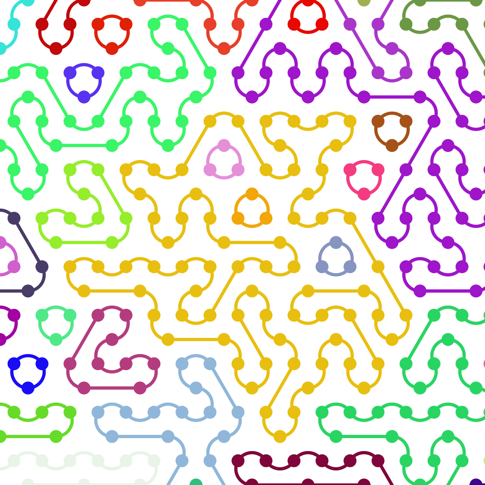
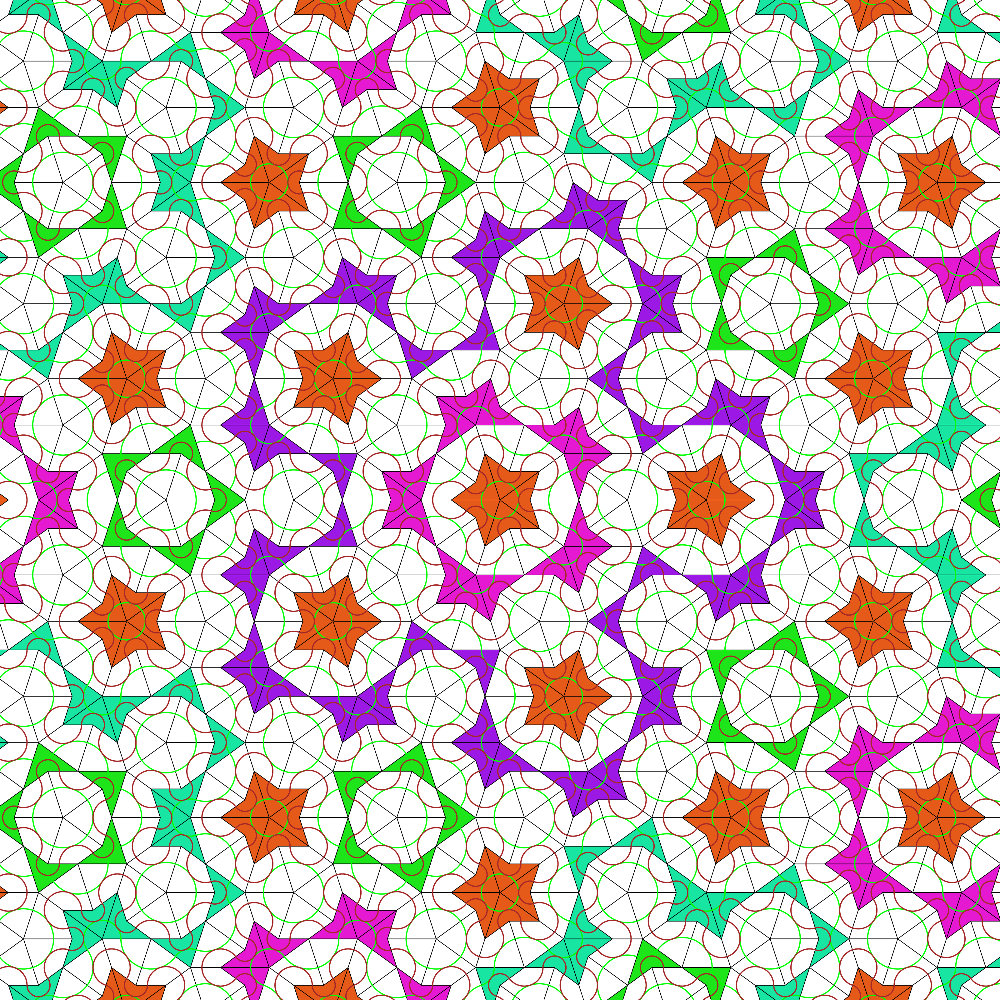
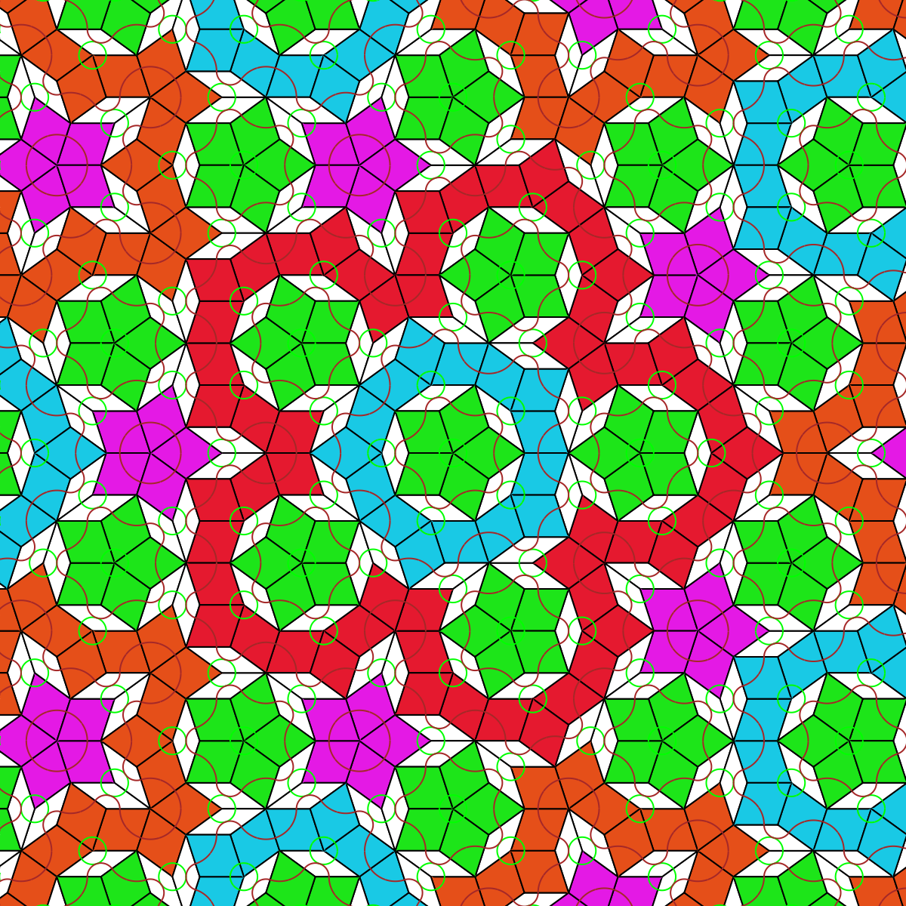

# Generative Tiling & Geometry in Go

A high-performance toolkit for generating complex geometric patterns, featuring Penrose Aperiodic Tilings and Hexagonal Truchet Tiles. Built with Go, this project combines mathematical precision with generative art.🧩 Featured Tilings1. Penrose Tilings (P2 & P3)Implements the famous aperiodic tilings discovered by Roger Penrose.Algorithms: Uses recursive subdivision (deflation) of Robinson triangles.Connectivity: Builds a topological graph using spatial hashing (midpoint keys) to identify shared edges.BFS Coloring: Analyzes the graph via Breadth-First Search to color connected "ribbons" or "bands" of tiles.2. Hexagonal Truchet TilesA modular tiling system based on hexagonal cells with randomized internal paths.Geometry: Efficiently handles hexagonal coordinate systems.Visuals: Creates flowing, maze-like structures that contrast with the rigid symmetry of Penrose tiles.🚀 Technical HighlightsPure Go: No heavy dependencies, using complex128 for clean geometric transformations.Hybrid Export: Supports high-resolution PNG rendering via fogleman/gg and scalable SVG for vector-perfect output.Interface-Driven: Uses a Shape interface, allowing the same deflation and graph-processing logic to work across different tiling systems.🛠 Installation & UsageBash# Clone the repository
git clone https://github.com/flightphone/penrose_tile
cd penrose_tile

# Install dependencies
go get -u github.com/fogleman/gg

# Run the generator
go run .
📐 How the Graph Logic WorksTo solve the floating-point precision issue ($0.1 + 0.2 \neq 0.3$), the project uses a custom "Point Key" system:Coordinates are rounded and formatted into strings.These strings act as unique identifiers for vertices in a map.This allows the BFS algorithm to "walk" across the tiling and identify large-scale structures regardless of the recursion depth.

# Truchet Tiles

# Penrose P2

# Penrose P3
